# 🌦️ Glasscast

Glasscast is a modern iOS weather application built with **SwiftUI**, following **MVVM architecture**, featuring a **glassmorphism UI**, **Supabase authentication**, and **OpenWeather API** integration.  
The app supports **Dark Mode**, **haptic feedback**, **pull-to-refresh**, and a **custom animated tab navigation**.

---

## ✨ Features

- 🔐 Authentication (Sign In / Sign Up) using **Supabase**
- 🌍 Current weather & 5-day forecast
- ❤️ Favorite cities synced per user
- 🔍 City search with geocoding
- 🧭 Location-based weather
- 🌓 Light & Dark mode (system-aware)
- 📱 Custom bottom tab navigation
- 🎯 Smooth animations & transitions
- 🤏 Subtle haptic feedback
- 🔄 Pull-to-refresh
- 🧱 Clean MVVM architecture
- 🧩 Widget-ready architecture

---

## 🏗️ Architecture

Glasscast follows **MVVM** with clear separation of concerns:
```
Glasscast/
├── App/
│   └── GlasscastApp.swift
│   └── RootView.swift
│   └── RootTabView.swift
│
├── Core/
│   ├── Networking/
│   │   ├── WeatherService.swift
│   │   └── APIClient.swift
│   │
│   ├── Theme/
│   │   ├── AppTheme.swift
│   │   ├── Theme.swift
│   │   └── ThemeManager.swift
│   │
│   ├── Supabase/
│   │   ├── SupabaseClient.swift
│   │   ├── AuthManager.swift
│   │   └── FavoritesService.swift
│   │
│   ├── Location/
│   │   └── LocationManager.swift
│   │
│   ├── Models/
│   │   ├── WeatherModels.swift
│   │   └── City.swift
│   │
│   └── Utilities/
│       ├── Constants.swift
│       ├── Environment.swift
│       ├── SessionManager.swift (or AuthManager)
│       └── Extensions/
│
├── Features/
│   ├── Auth/
│   │   ├── View/
│   │   │   └── AuthView.swift
│   │   └── ViewModel/
│   │       └── AuthViewModel.swift
│   │
│   ├── Home/
│   │   ├── View/
│   │   │   └── HomeView.swift
│   │   └── ViewModel/
│   │       └── HomeViewModel.swift
│   │
│   ├── Search/
│   │   ├── View/
│   │   │   └── SearchView.swift
│   │   └── ViewModel/
│   │       └── SearchViewModel.swift
│   │
│   └── Settings/
│       ├── View/
│       │   └── SettingsView.swift
│       └── ViewModel/
│           └── SettingsViewModel.swift
│
└── Resources/
    ├── Assets.xcassets
    └── PreviewData/
```

---


---

## 🛠️ Tech Stack

- **SwiftUI**
- **MVVM**
- **Supabase** (Auth + Database)
- **OpenWeather API**
- **CoreLocation**
- **WidgetKit-ready**
- **Async/Await**
- **Apple Haptics APIs**

---

## 🚀 Setup Instructions

### 1️⃣ Clone the Repository

```bash
git clone https://github.com/vishwas-kr/Glasscast.git
cd Glasscast
```

### 2️⃣ Open in Xcode

- Open Glasscast.xcodeproj
- Use Xcode 15+
- iOS 17+ recommended

### 🔐 Supabase Configuration

Glasscast uses Supabase for authentication and user data.

Create a Supabase Project

Go to https://supabase.com

## Create a new project
Note the following:
- Project URL
- Anon Public API Key

## Configure Environment Variables

Add the following keys to Info.plist:
| Key                 | Value                         |
| ------------------- | ----------------------------- |
| `SUPABASE_URL`      | Your Supabase Project URL     |
| `SUPABASE_ANON_KEY` | Your Supabase Public Anon Key |

Example:
```
<key>SUPABASE_URL</key>
<string>https://your-project-id.supabase.co</string>

<key>SUPABASE_ANON_KEY</key>
<string>your-public-anon-key</string>
```
<p align="left">
  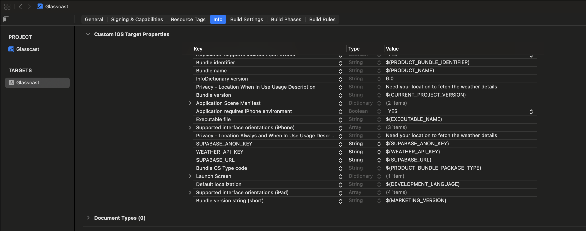
</p>


## Supabase Database Setup
Run this SQL in the Supabase SQL Editor:

```
create table public.favorite_cities (
    id uuid primary key default gen_random_uuid(),
    user_id uuid not null references auth.users(id) on delete cascade,
    city_name text not null,
    lat double precision not null,
    lon double precision not null,
    created_at timestamptz not null default now()
);

alter table public.favorite_cities enable row level security;

create policy "Users can view their favorite cities"
on public.favorite_cities
for select
using (auth.uid() = user_id);

create policy "Users can add favorite cities"
on public.favorite_cities
for insert
with check (auth.uid() = user_id);

create policy "Users can delete their favorite cities"
on public.favorite_cities
for delete
using (auth.uid() = user_id);
```
### 🌤️ OpenWeather API Setup

1. Create an account at https://openweathermap.org
2. Generate an API key
3. Add it to Info.plist:
```
<key>OPENWEATHER_API_KEY</key>
<string>your_api_key_here</string>
```
[▶ Stitch UI ](https://stitch.withgoogle.com/projects/350918878521551174)
Stickt 

### 📸 App Screenshots:

Light Mode:
<p align="left">
  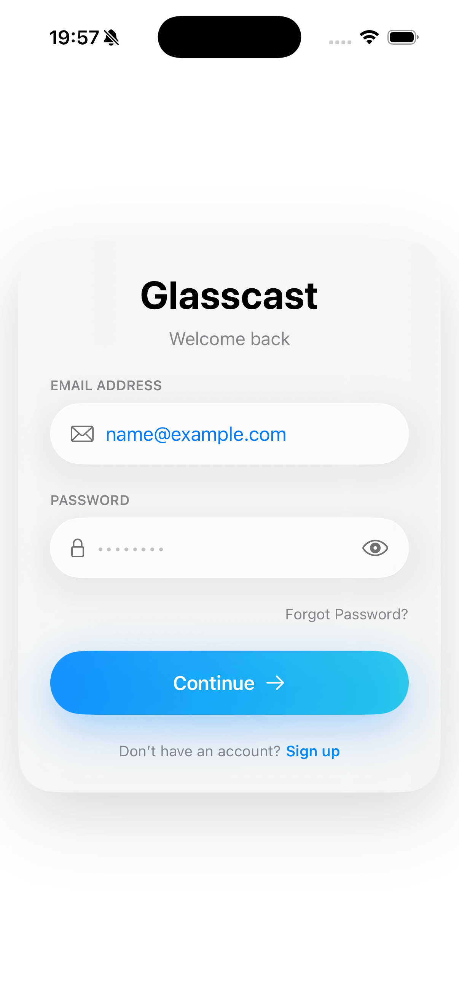
  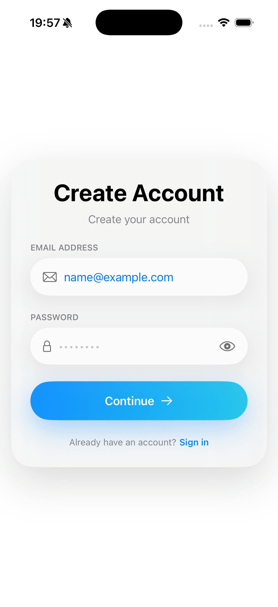
  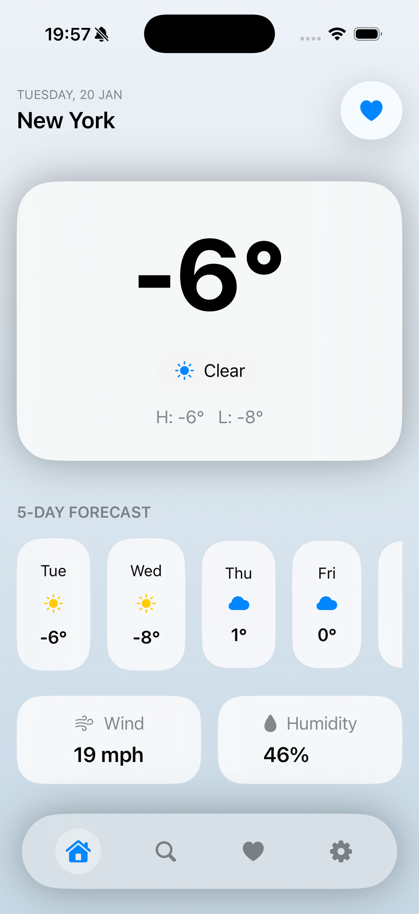
  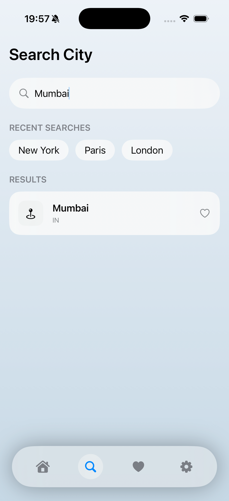
  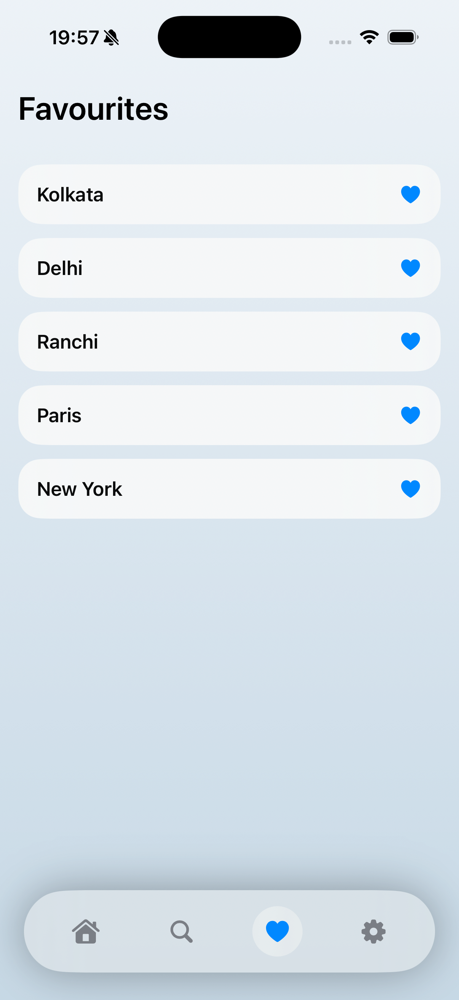
  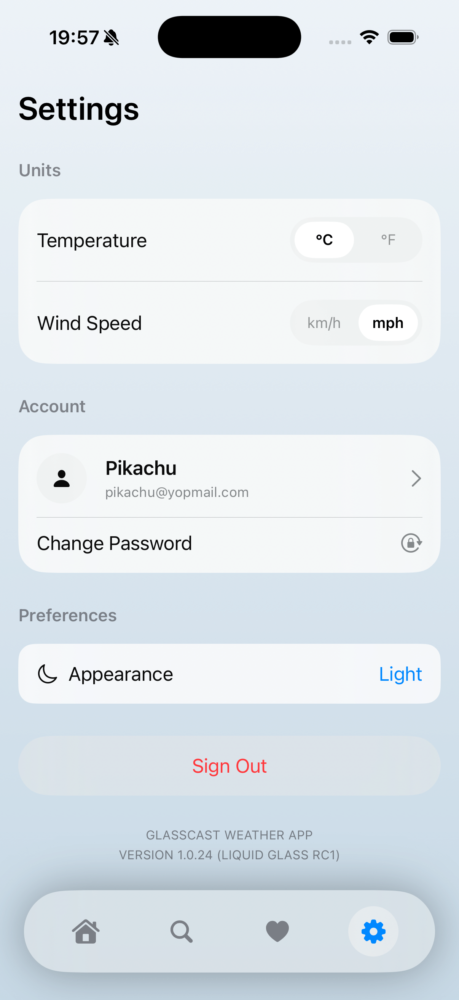
</p>

Dark Mode:
<p align="left">
  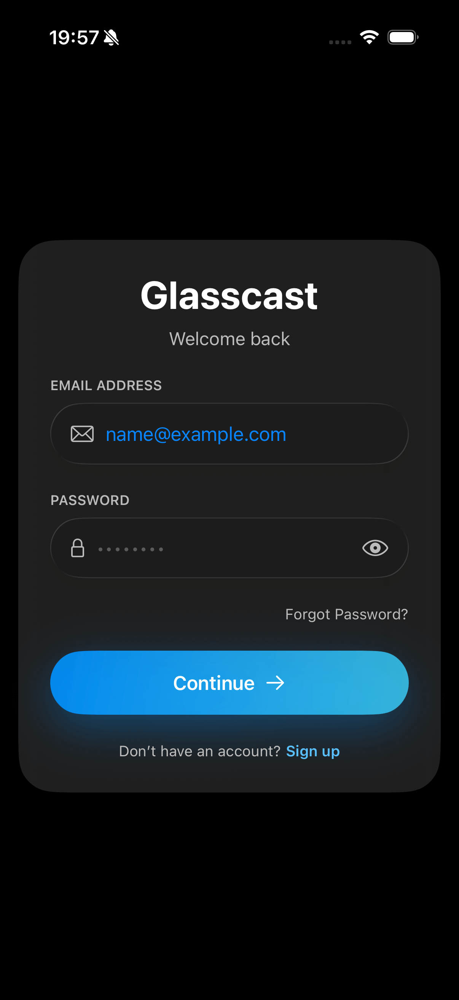
  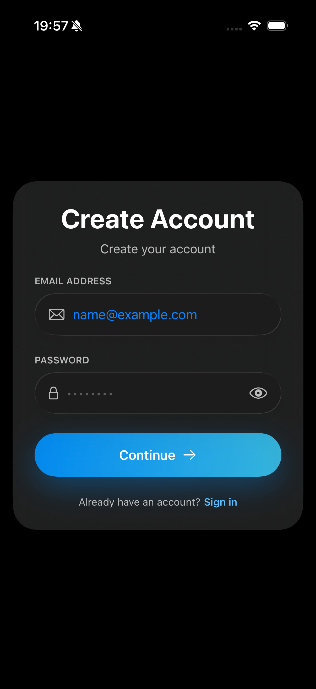
  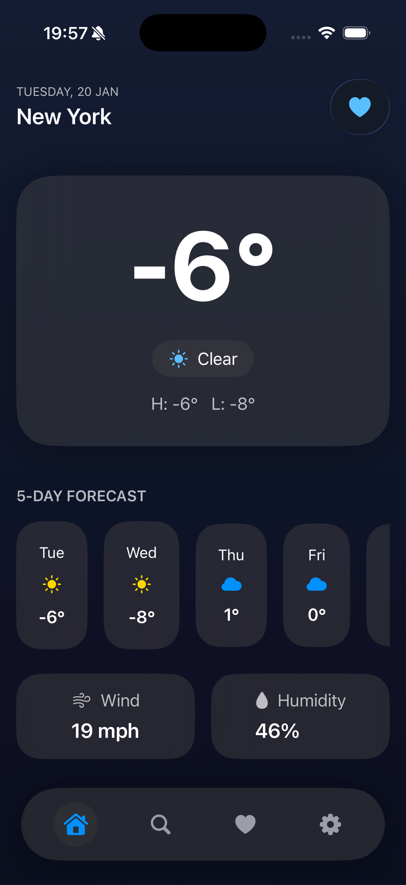
  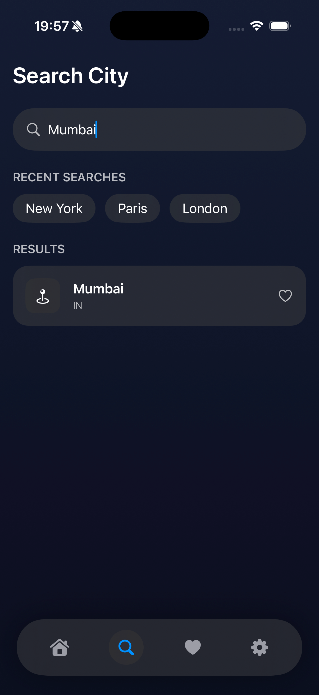
  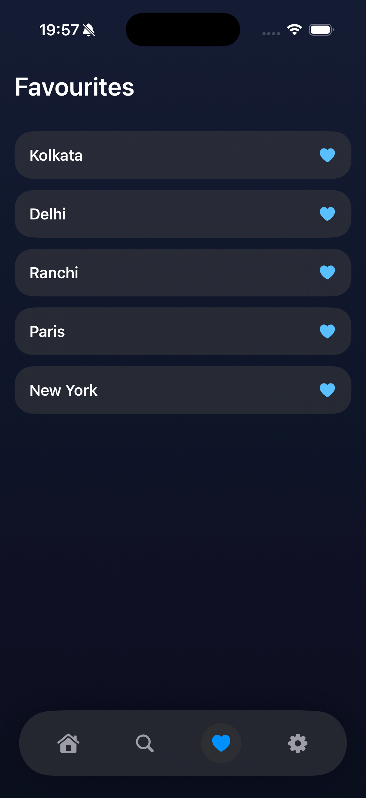
  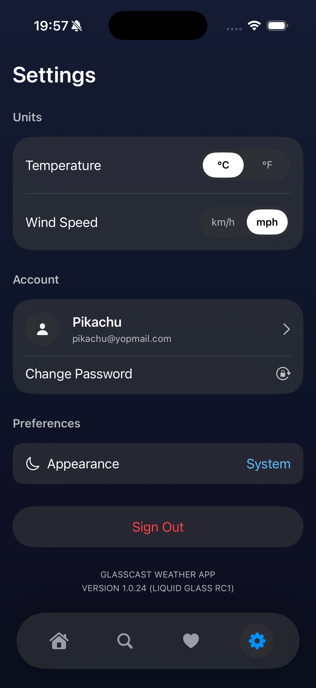
</p>

### Working Video 
[▶ Watch demo ](https://drive.google.com/file/d/1_uRAF8L6SI83WzsU3PJ6vCTXUQ2giCeG/view?usp=sharing)

### Prompt Video : Gemini
[▶ Prompt](https://drive.google.com/file/d/1s8OpfvcDzTJa1pfXN6r9-Brl7PzHe5mv/view?usp=sharing)


